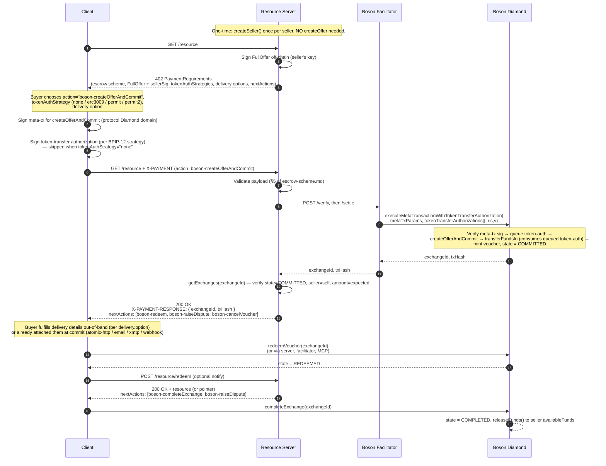
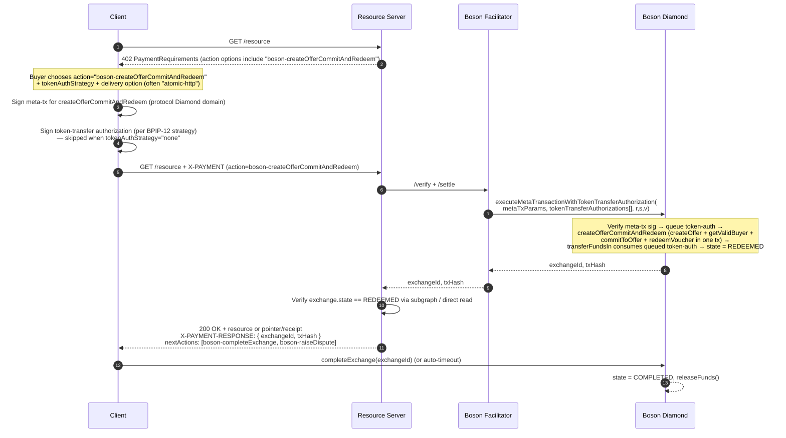
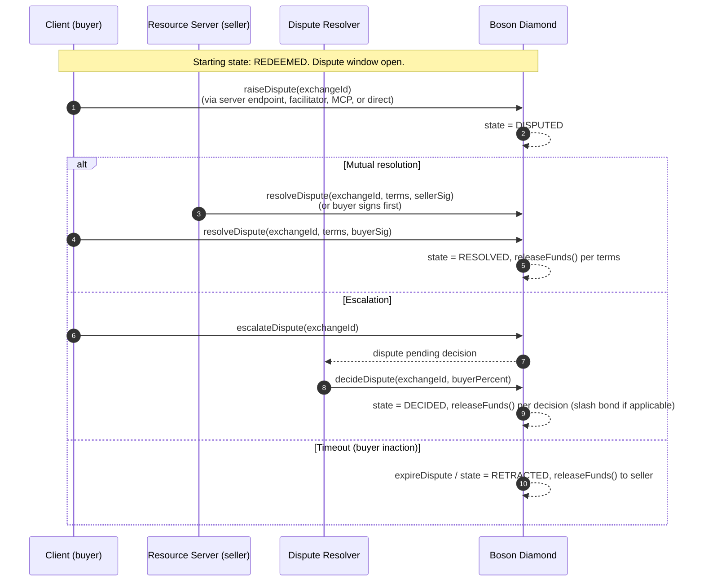
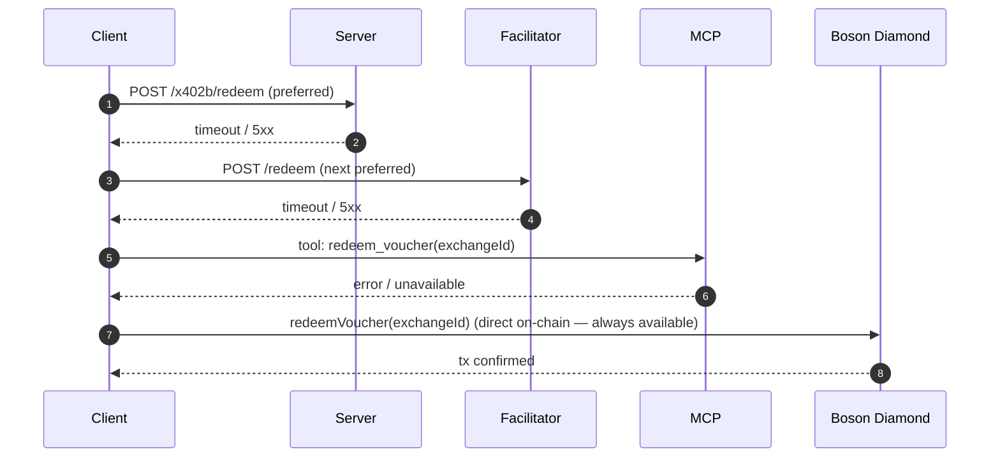

# 02 — Flows

> **Status:** detailed spec (v0.1, 2026-05-04). Sequence diagrams are the canonical source for the implementation.

## Flow A — Deferred redemption (commit now, redeem later)

The buyer commits to a freshly-created offer and receives a **voucher** — an ERC-721 NFT minted by the Boson Diamond. The voucher represents the buyer's right to redeem the offer and can be **transferred or traded on secondary markets** before redemption; whoever holds the voucher at redemption time is the redeemer. Redemption happens in a separate step when the buyer (or secondary holder) is ready. Use this when the buyer wants to inspect the offer state on-chain, intends to trade the voucher, or when the resource isn't ready at commit time (physical goods, asynchronous services).

Notes:

- The single facilitator call is `MetaTransactionsHandlerFacet.executeMetaTransactionWithTokenTransferAuthorization(...)` per [BPIP-12](https://github.com/zajck/BPIPs/blob/authorized-token-transfer-metaTx/content/BPIP-12.md). Inside the Diamond, the meta-tx entrypoint queues the token-auth into transient storage; the underlying `createOfferAndCommit` calls `FundsBase.transferFundsIn`, which consumes the queued auth.
- The minted voucher is a standard ERC-721 token. The original buyer can transfer it to any address; the recipient becomes the rightful redeemer and can call `redeemVoucher(exchangeId)` on their own behalf. This enables secondary markets for uncommitted commitments — a buyer can sell their "right to redeem" to another party before the voucher is exercised.
- The buyer (or current voucher holder) can switch to redeeming via the server, the facilitator, MCP, or directly on-chain — `nextActions` lists each available channel.

## Flow B — Atomic commit-and-redeem (single transaction)

The buyer collapses the **commit** and **redeem** state transitions into a single on-chain transaction. This is purely a choice about *when the on-chain redeem happens*; it is **independent of when the actual resource is delivered**.

Use Flow B when the buyer wants to assert "consider this redeemed now" up front. Common cases:

- Atomic delivery — the resource is returned in the same HTTP 200 response (e.g. a small JSON payload, a license key, a signed access token).
- Asynchronous delivery — the resource takes time to produce (e.g. a generated report) but the buyer is happy to redeem on commit and receive the deliverable later through whichever delivery transport they negotiated. The post-200 dispute window is the buyer's protection if delivery never arrives.
- Pre-staged delivery — the resource is already available off-chain (IPFS, gated URL) and the redeem is just the on-chain proof.

The mechanics are identical regardless of delivery timing — `OrchestrationHandlerFacet2.createOfferCommitAndRedeem` from PR #1105 handles the on-chain side, and the chosen `delivery.option` handles the delivery side.

Notes:

- `OrchestrationHandlerFacet2.createOfferCommitAndRedeem` (PR #1105) emits `OfferCreated`, `BuyerCommitted`, and `VoucherRedeemed` in a single tx. The committer (and thus the redeemer) is `_msgSender()` — under the meta-tx entrypoint that is the buyer recovered from the meta-tx signature, so no extra redeem signature is needed.
- Dispute window still applies post-redeem; see Flow C.

## Flow C — Dispute path

The buyer raises a dispute within the dispute window. Either party can attempt mutual resolution; if unresolved, escalation invokes the registered dispute resolver.

The buyer reaches the dispute primitives through whichever channel `nextActions.fallback` advertises. The server's convenience endpoint (e.g. `POST /x402b/dispute/raise`) is one option; the others are facilitator, on-chain direct, MCP, XMTP-to-seller. See [boson-impl-04-state-machine-and-next-actions.md](./boson-impl-04-state-machine-and-next-actions.md) for the full channel registry.

## Flow D — Channel fallback (when the server is unreachable)

After the initial 402, every subsequent step has an off-server alternative. Concrete fallback ordering for a "redeem" action when the server endpoint is offline:

Order is set by `nextActions[i].channels[]` in the most recent server response (or, after server loss, by `requirements.actions.fallback`). The client SDK exposes a `tryAllChannels()` helper that walks the list and returns on the first success.

## Verification points (per flow)

| Flow | Server-side verify | Client-side verify |
|---|---|---|
| A. Deferred redemption | `state === COMMITTED`, `seller === self`, `exchangeToken === asset`, `price === amount` | `txHash` mined, `voucherId` matches expected offerHash; voucher is ERC-721 and transferable |
| B. Atomic commit-and-redeem | `state === REDEEMED`, all of the above | `OfferCreated + BuyerCommitted + VoucherRedeemed` events in one receipt. Delivery may still be asynchronous — the buyer tracks it via the chosen `delivery.option`. |
| C. Dispute | state transitions match invoked function | event log signatures match the action |
| D. Fallback | n/a | each channel returns a structured success or moves to the next |
