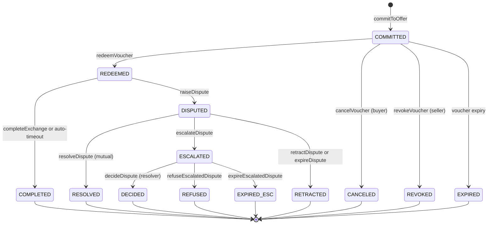

# 04 — State Machine & `nextActions`

> **Status:** detailed spec (v0.1, 2026-05-04). Defines how the protocol stays self-describing across responses and how the buyer is never locked into the seller's HTTP server.

## Why every response carries `nextActions`

x402B is more than a single round-trip. After commit, the buyer can redeem, raise a dispute, complete the exchange, and so on — across multiple round-trips potentially over hours or weeks. A long-lived protocol where the server unilaterally decides "what's next" risks two failure modes:

1. **Censorship:** if the server refuses to forward a buyer's redeem or dispute, the buyer is stuck.
2. **Stale clients:** SDKs hard-code the state machine and break when the protocol grows.

The fix: every server response carries a top-level `nextActions` envelope listing the legal transitions from the current exchange state and **every channel through which the buyer can invoke each transition** — server endpoint, facilitator, on-chain direct, MCP, XMTP, etc. The client picks any. If one channel fails, the client falls back to the next.

## Exchange state machine (Boson protocol, v2.5+)



For each *non-terminal* state, the SDK derives the legal next actions from this graph. The 402 itself targets the implicit "pre-commit" state and offers `createOfferAndCommit` / `createOfferCommitAndRedeem`.

## `nextActions` envelope

Every server response (the initial 402, the 200 after commit, the 200 after redeem, after dispute, …) includes:

```jsonc
"nextActions": {
  "exchangeId": "12345",                  // omitted on the initial 402
  "state": "REDEEMED",                    // omitted on the initial 402
  "next": [
    {
      "id": "boson-completeExchange",
      "channels": ["server", "facilitator", "onchain", "mcp"],
      "endpoints": { "server": "https://seller.example/x402B/complete" },
      "deadline": "2026-05-11T00:00:00Z"  // optional, absolute
    },
    {
      "id": "boson-raiseDispute",
      "channels": ["server", "facilitator", "onchain", "mcp", "xmtp"],
      "endpoints": { "server": "https://seller.example/x402B/dispute/raise" },
      "deadline": "2026-05-11T00:00:00Z"
    }
  ],
  "fallback": {
    "xmtp": "0xSellerXMTP...",
    "mcp":  "boson://seller/12345",
    "onchainHints": {
      "diamond":   "0xDiamond...",
      "facet":     "ExchangeHandlerFacet",  // varies per action
      "metaTxFacet":      "MetaTransactionsHandlerFacet",
      "metaTxEntrypoint": "executeMetaTransactionWithTokenTransferAuthorization"
    }
  }
}
```

The envelope sits at the top level of the JSON response body. For the initial 402 it's nested inside the `accepts[i].actions` field (since there's no exchangeId yet) — see [boson-impl-01-escrow-scheme.md](./boson-impl-01-escrow-scheme.md) §2.

## Action IDs

Stable string identifiers, one per legal transition. All Boson-specific ids carry the `boson-` prefix so the `escrow` scheme can later host other escrow implementations (e.g. `coinbase-…`) without collision.

| Action ID | Boson primitive | Pre-state | Post-state |
|---|---|---|---|
| `boson-createOfferAndCommit` | `ExchangeCommitFacet.createOfferAndCommit` (deferred) | (none) | COMMITTED |
| `boson-createOfferCommitAndRedeem` | `OrchestrationHandlerFacet2.createOfferCommitAndRedeem` (atomic on-chain redeem) | (none) | REDEEMED |
| `boson-redeem` | `redeemVoucher` | COMMITTED | REDEEMED |
| `boson-cancelVoucher` | `cancelVoucher` | COMMITTED | CANCELED |
| `boson-revokeVoucher` | `revokeVoucher` | COMMITTED | REVOKED |
| `boson-completeExchange` | `completeExchange` | REDEEMED | COMPLETED |
| `boson-raiseDispute` | `raiseDispute` | REDEEMED | DISPUTED |
| `boson-resolveDispute` | `resolveDispute` | DISPUTED | RESOLVED |
| `boson-escalateDispute` | `escalateDispute` | DISPUTED | ESCALATED |
| `boson-retractDispute` | `retractDispute` | DISPUTED | RETRACTED |
| `boson-decideDispute` | `decideDispute` | ESCALATED | DECIDED |

The list lives in `@bosonprotocol/x402-actions` as a single source of truth. The state machine derives `next[]` from the action table; servers never hand-code transitions. Clients that don't recognise an action's prefix MUST skip it rather than try to dispatch.

## Channels

A **channel** is a transport for invoking an action. The standard registry:

| Channel | What it means | Invocation shape |
|---|---|---|
| `server` | The seller's HTTP server exposes a convenience endpoint that wraps the on-chain call (and may notify the seller for context). | `POST <endpoints.server>` with action-specific body. |
| `facilitator` | A third-party facilitator that submits on-chain on the buyer's behalf (gas-paying meta-tx). | `POST <facilitator>/x402B/<action>` per the facilitator's API (see [boson-impl-07-facilitator.md](./boson-impl-07-facilitator.md)). |
| `onchain` | Direct on-chain submission. The buyer signs and submits the raw tx themselves. | `<facet>.<method>(...)` per `onchainHints`. |
| `mcp` | The buyer's agent calls a Boson MCP tool (e.g. `bosonprotocol/agentic-commerce`). | MCP tool invocation; identifier in `fallback.mcp`. |
| `xmtp` | Out-of-band: the buyer messages the seller's XMTP inbox; the seller can act on behalf of the buyer for some actions, or simply acknowledge. | XMTP message to `fallback.xmtp` with structured payload. |

`channels[]` ordering on the server response is the seller's *preferred* order, but the client SDK is free to override based on its own policy (e.g. AI-agent clients may always prefer `onchain` or `mcp`).

## Censorship resistance — guarantees

The protocol guarantees that for every non-terminal state, the buyer can advance the exchange *without the seller's cooperation*:

| Action | Buyer-only path | Seller-only path |
|---|---|---|
| `boson-redeem` | onchain ✓ | — |
| `boson-completeExchange` | onchain ✓ (or auto-timeout ✓) | — |
| `boson-raiseDispute` | onchain ✓ | — |
| `boson-escalateDispute` | onchain ✓ | — |
| `boson-retractDispute` | onchain ✓ | — |
| `boson-cancelVoucher` | onchain ✓ | — |
| `boson-createOfferAndCommit` / `boson-createOfferCommitAndRedeem` | onchain ✓ (signing tx themselves) | — |

The `server` channel is **always optional**. A server that withholds endpoints, returns garbage `nextActions`, or simply disappears does not strand the buyer. The client SDK falls through to `onchain` after a configurable timeout. See [boson-impl-02-flows.md](./boson-impl-02-flows.md) Flow D.

## Server-side derivation

The server doesn't curate `nextActions` by hand. It does:

```ts
import { deriveNextActions } from "@bosonprotocol/x402-actions";

const exchange = await sdk.exchanges.get(exchangeId);
const nextActions = deriveNextActions(exchange, {
  channels: serverConfig.advertisedChannels,        // e.g. ["server", "facilitator", "onchain", "mcp"]
  endpoints: serverConfig.endpoints,                 // map of action-id → server url
  fallback: serverConfig.fallback,                   // xmtp / mcp / onchainHints
});
```

`deriveNextActions` reads exchange.state, looks up legal transitions, applies dispute window math (`deadline`), and stamps each entry with the configured channels.

## Client-side execution

```ts
import { performAction } from "@bosonprotocol/x402-client";

const result = await performAction(nextActions, "boson-raiseDispute", {
  payload: { ... },
  channelOrder: ["server", "facilitator", "onchain", "mcp"],
  signer,
});
// result = { channelUsed: "onchain", txHash: "0x..." }
```

`performAction` walks `channelOrder`, invoking each channel's adapter until one returns success. On final failure it throws with all per-channel errors attached.

## Versioning

The action-id table and channel registry are versioned with the SDK. New actions can be added without breaking older clients (clients ignore unknown ids; the on-chain primitives themselves are stable). New channels (e.g. `nostr`, `farcaster`) similarly extend the registry without breaking old clients — they simply skip unknown channels and fall back to known ones.

## Open items

- **Deadlines:** absolute ISO timestamps in `deadline` are computed from on-chain durations + commit timestamp. Clock skew tolerance: 30s.
- **Multi-action atomicity:** for `resolveDispute`, both buyer and seller must sign. The envelope advertises the action; the helper coordinates the dual-signature collection out of band. Specced separately.
- **Per-channel priority hints from the seller** (e.g. "prefer my MCP over my server"): considered, deferred to v2.
