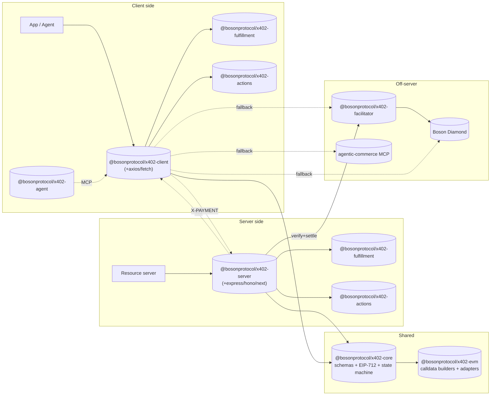

# 00 — x402B Overview

> **Status:** detailed spec (v0.1, 2026-05-04).

## What x402B is

x402B is the Boson Protocol implementation of the [`x402-escrow-schema`](https://github.com/bosonprotocol/x402-escrow-schema). It keeps x402's HTTP-native, gasless, single-round-trip UX and replaces the trusted-server payment model with **Boson Protocol escrow**. Funds enter a non-custodial Boson Diamond escrow at commit time; they release to the seller only after the buyer signals delivery (or the dispute window expires); a registered third-party dispute resolver can split funds and slash a seller bond if delivery fails.

The SDK is designed so that **existing x402 servers and clients can adopt it as a drop-in addition**. Servers add a Boson scheme to their `accepts[]` array; clients that understand the `escrow` scheme handle it, and those that don't fail cleanly with a structured "unsupported scheme" error — never an accidental settle.

## Architecture at a glance

## Package map

All packages publish under `@bosonprotocol/`.

| Package | Purpose |
|---|---|
| `x402-core` | `escrow` scheme JSON schemas + TypeScript types; EIP-712 builders for FullOffer (protocol domain), the protocol meta-tx envelope, and the four BPIP-12 token-auth strategies (ERC-3009 ReceiveWithAuthorization, EIP-2612 Permit, Permit2, plain approve); exchange state machine model. |
| `x402-evm` | EVM-specific implementation. Calldata builders for `ExchangeCommitFacet.createOfferAndCommit` (deferred) and `OrchestrationHandlerFacet2.createOfferCommitAndRedeem` (atomic on-chain redeem), plus viem `Web3LibAdapter` bridges used by facilitator/core-sdk meta-transaction submission. Wraps `@bosonprotocol/core-sdk`. |
| `x402-server` | Framework-agnostic resource server. 402 builder, FullOffer signer wrapper, fulfillment negotiator, `nextActions` emitter, post-redeem endpoint set. Adapter sub-packages: `x402-server-express`, `x402-server-hono`, `x402-server-next`. |
| `x402-client` | Framework-agnostic client. Interceptor that parses the 402, picks a fulfillment channel option and a token-auth strategy, signs the meta-tx + token authorization(s), retries, then drives post-redeem actions through whichever channel is preferred. Adapters: `x402-client-axios`, `x402-client-fetch`. |
| `x402-facilitator` | Reference verify + settle + perform-action service for the `escrow` scheme. Submits through `coreSdk.executeMetaTransaction(...)`, which routes to the bare meta-tx entrypoint or the BPIP-12 token-transfer-authorization entrypoint based on the chosen token-auth strategy. |
| `x402-fulfillment` | Pluggable `FulfillmentChannel` interface + atomic / email / XMTP / webhook / IPFS-pointer implementations. |
| `x402-actions` | Exchange state machine + channel registry. Powers the `nextActions` envelope on every server response and the post-redeem endpoint set. |
| `x402-agent` | Thin glue layer for AI-agent clients. Bridges to `bosonprotocol/agentic-commerce` MCP and lets agents pick channel (server / facilitator / on-chain / MCP) per action. |

## What we reuse (do not rebuild)

- `@bosonprotocol/core-sdk` — contract calls, subgraph reads, meta-tx helpers, dispute helpers.
- `@bosonprotocol/metadata` — offer metadata schemas (extend with seller channel registry, see [09](./boson-impl-09-seller-metadata.md)).
- `@bosonprotocol/common` — EIP-712 hashing helpers (FullOffer hash matches BPIP-10 / `OrchestrationHandlerFacet2`).
- `bosonprotocol/agentic-commerce` — MCP exposing on-chain Boson actions, used by `x402-agent`.
- The Boson Redemption Widget backend hook — for human buyers of physical goods, surfaced as one of the fulfillment channels ([03](./boson-impl-03-fulfillment-channels.md)).

## What we are explicitly *not* doing

- No upstream PR to `@x402/extensions`. The `escrow` scheme is independent.
- No new Diamond facets beyond what PRs #1104 and #1105 already deliver.
- No new audit scope beyond those two PRs.

## Spec document map

| # | File | Status |
|---|---|---|
| 00 | [overview.md](./boson-impl-00-overview.md) | detailed (this file) |
| 01 | [escrow-scheme.md](./boson-impl-01-escrow-scheme.md) | detailed |
| 02 | [flows.md](./boson-impl-02-flows.md) | detailed |
| 03 | [fulfillment-channels.md](./boson-impl-03-fulfillment-channels.md) | detailed |
| 04 | [state-machine-and-next-actions.md](./boson-impl-04-state-machine-and-next-actions.md) | detailed |
| 05 | [server-sdk.md](./boson-impl-05-server-sdk.md) | stub |
| 06 | [client-sdk.md](./boson-impl-06-client-sdk.md) | stub |
| 07 | [facilitator.md](./boson-impl-07-facilitator.md) | implemented library surface |
| 08 | [agent-mode.md](./boson-impl-08-agent-mode.md) | stub |
| 09 | [seller-metadata.md](./boson-impl-09-seller-metadata.md) | stub |
