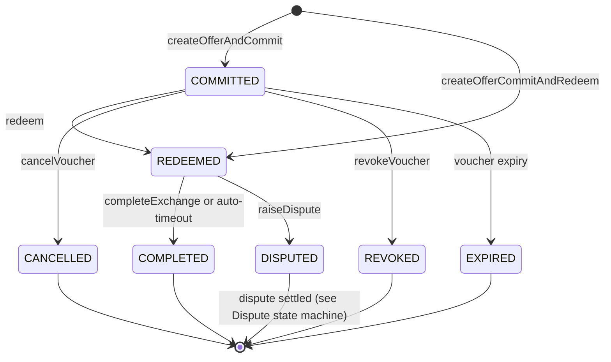
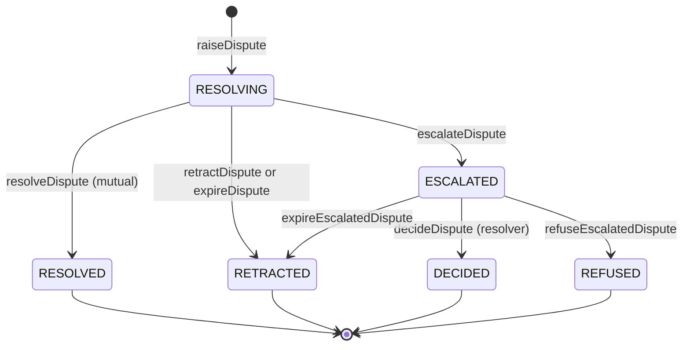

# 04 — State Machine & `nextActions`

> **Status:** detailed spec (v0.1, 2026-05-04). Defines how the protocol stays self-describing across responses and how the buyer is never locked into the seller's HTTP server.

## Why every response carries `nextActions`

x402B is more than a single round-trip. After commit, the buyer can redeem, raise a dispute, complete the exchange, and so on — across multiple round-trips potentially over hours or weeks. A long-lived protocol where the server unilaterally decides "what's next" risks two failure modes:

1. **Censorship:** if the server refuses to forward a buyer's redeem or dispute, the buyer is stuck.
2. **Stale clients:** SDKs hard-code the state machine and break when the protocol grows.

The fix: every server response carries a top-level `nextActions` envelope listing the legal transitions from the current exchange state and **every channel through which the buyer can invoke each transition** — server endpoint, facilitator, on-chain direct, MCP, XMTP, etc. The client picks any. If one channel fails, the client falls back to the next.

## State machines (Boson protocol, v2.5+)

The protocol uses **two separate state machines**. Their canonical enum states are exposed via `@bosonprotocol/x402-core/state-machine`; this spec also describes a small number of buyer-facing **derived/virtual** states used for UX and action derivation:

- **`ExchangeState`** — every exchange's lifecycle. Six values, sourced verbatim from `@bosonprotocol/core-sdk`'s subgraph schema: `COMMITTED`, `REDEEMED`, `COMPLETED`, `DISPUTED`, `CANCELLED`, `REVOKED`. The state-machine module also defines the synthetic `PRE_COMMIT` marker for the initial 402 (no exchange yet). This spec additionally refers to the subgraph-derived `EXPIRED` virtual state (a `COMMITTED` exchange whose voucher is past its `validUntil`), but `EXPIRED` is **not** currently represented as an exported enum/state in `@bosonprotocol/x402-core/state-machine`.
- **`DisputeState`** — only present once `raiseDispute` has been called. Six values, also from core-sdk: `RESOLVING`, `RESOLVED`, `ESCALATED`, `RETRACTED`, `DECIDED`, `REFUSED`. The exchange itself stays in `DISPUTED` for the duration; the dispute entity transitions independently.

Buyer-facing client state is the composite `(exchange, dispute?)`. The SDK looks up legal actions from this composite key; see §"Action IDs" below.

### Exchange state machine



### Dispute state machine



For each non-terminal `(exchange, dispute?)` pair, the SDK derives the legal next actions from these graphs. The 402 itself targets the synthetic `PRE_COMMIT` state and offers `createOfferAndCommit` / `createOfferCommitAndRedeem` (and, in a future release, `commitToConditionalOffer` / `commitToConditionalOfferAndRedeemVoucher`).

## `nextActions` envelope

Every server response (the initial 402, the 200 after commit, the 200 after redeem, after dispute, …) includes:

Example for an exchange that is `DISPUTED` with a dispute in `RESOLVING` — the buyer can resolve, escalate, or retract:

```jsonc
"nextActions": {
  "exchangeId": "12345",                  // omitted on the initial 402
  "exchangeState": "DISPUTED",            // ExchangeState; omitted on the initial 402
  "disputeState": "RESOLVING",            // DisputeState; present iff exchangeState === "DISPUTED"
  "next": [
    {
      "id": "boson-resolveDispute",
      "channels": ["server", "facilitator", "onchain", "mcp"],
      "endpoints": { "server": "https://seller.example/x402B/dispute/resolve" },
      "deadline": "2026-05-15T00:00:00Z"  // optional, absolute — dispute resolution window
    },
    {
      "id": "boson-escalateDispute",
      "channels": ["server", "facilitator", "onchain", "mcp"],
      "endpoints": { "server": "https://seller.example/x402B/dispute/escalate" },
      "deadline": "2026-05-15T00:00:00Z"
    },
    {
      "id": "boson-retractDispute",
      "channels": ["server", "facilitator", "onchain", "mcp", "xmtp"],
      "endpoints": { "server": "https://seller.example/x402B/dispute/retract" }
    }
  ],
  "fallback": {
    "xmtp": "0xSellerXMTP...",
    "mcp":  "boson://exchange/12345",          // identifier within the Boson MCP (e.g. `bosonprotocol/agentic-commerce`)
    "onchainHints": {
      "escrow":      "0xEscrow...",
      "metaTxFacet": "MetaTransactionsHandlerFacet",
      "metaTxEntrypoints": {                    // keyed by buyer's `tokenAuthStrategy`
        "none":    "executeMetaTransaction",
        "erc3009": "executeMetaTransactionWithTokenTransferAuthorization",
        "permit":  "executeMetaTransactionWithTokenTransferAuthorization",
        "permit2": "executeMetaTransactionWithTokenTransferAuthorization"
      },
      "actionFacets": {                          // facet hosting each emitted action
        "boson-resolveDispute":  "DisputeHandlerFacet",
        "boson-escalateDispute": "DisputeHandlerFacet",
        "boson-retractDispute":  "DisputeHandlerFacet"
      }
    }
  }
}
```

The envelope sits at the top level of the JSON response body. For the initial 402 it's nested inside the `accepts[i].actions` field (since there's no exchangeId yet) — see [boson-impl-01-escrow-scheme.md](./boson-impl-01-escrow-scheme.md) §2.

## Action IDs

Stable string identifiers, one per legal transition that either party (buyer or seller) can invoke. All Boson-specific ids carry the `boson-` prefix so the `escrow` scheme can later host other escrow implementations (e.g. `coinbase-…`) without collision.

`Side` distinguishes who can invoke each action. `Pre` and `Post` are the `(exchange[, dispute])` state before/after the action — empty exchange means the synthetic `PRE_COMMIT` state, empty dispute means no dispute is active.

| Action ID | Boson primitive | Side | Pre | Post |
|---|---|---|---|---|
| `boson-createOfferAndCommit` | `ExchangeCommitFacet.createOfferAndCommit` (deferred) | client | `PRE_COMMIT` | `(COMMITTED)` |
| `boson-createOfferCommitAndRedeem` | `OrchestrationHandlerFacet2.createOfferCommitAndRedeem` (atomic on-chain redeem) | client | `PRE_COMMIT` | `(REDEEMED)` |
| `boson-redeem` | `redeemVoucher` | client | `(COMMITTED)` | `(REDEEMED)` |
| `boson-cancelVoucher` | `cancelVoucher` | client | `(COMMITTED)` | `(CANCELLED)` |
| `boson-revokeVoucher` | `revokeVoucher` | server | `(COMMITTED)` | `(REVOKED)` |
| `boson-completeExchange` | `completeExchange` | client | `(REDEEMED)` | `(COMPLETED)` |
| `boson-raiseDispute` | `raiseDispute` | client | `(REDEEMED)` | `(DISPUTED, RESOLVING)` |
| `boson-resolveDispute` | `resolveDispute` | mutual | `(DISPUTED, RESOLVING)` | `(DISPUTED, RESOLVED)` |
| `boson-escalateDispute` | `escalateDispute` | client | `(DISPUTED, RESOLVING)` | `(DISPUTED, ESCALATED)` |
| `boson-retractDispute` | `retractDispute` | client | `(DISPUTED, RESOLVING)` | `(DISPUTED, RETRACTED)` |

The action-id list and the two transition tables live in `@bosonprotocol/x402-core/state-machine` as a single source of truth. `@bosonprotocol/x402-actions` derives `next[]` from those tables at runtime; servers never hand-code transitions. Clients that don't recognise an action's prefix MUST skip it rather than try to dispatch.

**`boson-redeem` and the voucher-transfer case.** Because the Boson voucher is a transferable NFT, the wallet that signs `boson-redeem` is not necessarily the wallet that committed. Servers that accept the two-step flow MUST treat the redeem step as a fulfillment-data rebinding point: see [§Wallet rebinding at redeem in `03-fulfillment-channels.md`](./boson-impl-03-fulfillment-channels.md#wallet-rebinding-at-redeem) for the wallet-vs-fulfillment matrix.

**Out of scope for `nextActions`:**

- Dispute-resolver-only transitions (`decideDispute`, `refuseEscalatedDispute`) are protocol-level state changes but not buyer/seller-invokable, so they have no `boson-*` action id.
- Time-based transitions (voucher expiry, dispute timeout, escalation timeout) require no signer and are also not exposed as actions.

**Future additions** (tracked but not yet listed):

- `boson-commitToOffer` — commits to an existing offer (no fresh offer creation). Adds `(COMMITTED)` as a post-state from `PRE_COMMIT` alongside `createOfferAndCommit`.
- `boson-commitToConditionalOffer` — commits to an existing offer that gates entry on a token-holding condition. Same post-state as `commitToOffer`.
- `boson-commitToConditionalOfferAndRedeemVoucher` — the atomic commit-and-redeem variant for conditional offers, parallel to `createOfferCommitAndRedeem`.

These will land once the corresponding Boson Diamond facets stabilize.

## Entity-keyed actions

A second flavour of action lives alongside the exchange-keyed table above. **Entity-keyed actions** target a Boson account `entityId` (buyer or seller) rather than a single exchange, and do not transition the exchange / dispute state machine. They surface as standalone server endpoints rather than per-exchange transitions. The first entry:

| Action ID | Boson primitive | Side | Key | Server endpoint |
|---|---|---|---|---|
| `boson-withdrawFunds` | `FundsHandlerFacet.withdrawFunds(uint256,address[],uint256[])` | client OR server (the protocol enforces "must be an authorised signer for the entity") | `entityId` | `POST /x402b/withdraw-funds` |

The action id is exported from `@bosonprotocol/x402-core/state-machine` under `ENTITY_ACTION_IDS`; exchange-keyed ids stay accessible under `EXCHANGE_ACTION_IDS`. `ACTION_IDS` is the union of both. `ACTION_POST_STATE` is narrowed to exchange-keyed ids; `ACTION_FACETS` covers both (withdraw maps to `FundsHandlerFacet`). The helper `isEntityKeyedAction(action)` discriminates at runtime.

Read-only sibling: a `GET /x402b/available-funds` endpoint returns the current funds entity for a buyer/seller (sourced from the protocol subgraph via `coreSdk.getFunds`). Both endpoints accept either `entityId` directly or an EVM `address` (with optional `role: "buyer" | "seller"` to disambiguate addresses registered as both). See `docs/boson-impl-05-server-sdk.md` and `docs/boson-impl-07-facilitator.md` for wire-format details.

Scope cap for v1: the convenience layer signs *all* available funds at once. The on-chain primitive accepts arbitrary `(tokenList, tokenAmounts)` arrays; partial / user-chosen amounts can be added later without a wire-format change.

### `nextActions` integration

Entity-keyed actions stay out of `nextActions.next[]` for in-flight states — they apply regardless of any one exchange's state, so wedging them into every envelope would dilute the per-exchange signal. The one carve-out is **`(DISPUTED, RESOLVED)`**: a successful `boson-resolveDispute` releases both parties' escrowed funds to their available balances, and both `clientLegalActions` and `serverLegalActions` therefore surface `boson-withdrawFunds` as the sole transition for that state. The buyer's 200 after `resolveDispute` (and the seller-side SDK looking at the same state) ships a `next[]` containing one entry — withdraw — letting either party drain those funds in a single follow-up call without needing to know about the standalone endpoint up-front.

Other fund-releasing transitions (`completeExchange`, `cancelVoucher`, `revokeVoucher`, `retractDispute`, `decideDispute`, `refuseDispute`) could receive the same treatment in follow-up work; the state-machine update is mechanical.

## Channels

A **channel** is a transport for invoking an action. The standard registry:

| Channel | What it means | Invocation shape |
|---|---|---|
| `server` | The seller's HTTP server exposes a convenience endpoint that wraps the on-chain call (and may notify the seller for context). | `POST <endpoints.server>` with action-specific body. |
| `facilitator` | A third-party facilitator that submits on-chain on the buyer's behalf (gas-paying meta-tx). | Commit-time actions use `POST <facilitator>/settle`; post-commit actions use `POST <facilitator>/perform-action?action=<action>` per the facilitator's API (see [boson-impl-07-facilitator.md](./boson-impl-07-facilitator.md)). |
| `onchain` | Direct on-chain submission. The buyer signs and submits the raw tx themselves. | `<facet>.<method>(...)` per `onchainHints`. |
| `mcp` | The buyer's agent dispatches against the **escrow's** MCP server (the Boson Protocol MCP, currently [`bosonprotocol/agentic-commerce`](https://github.com/bosonprotocol/agentic-commerce)) — one shared server across every Boson seller, not a per-seller endpoint. The seller-specific routing lives in `fallback.mcp` as a Boson-namespaced identifier the BosonMCP resolves. | MCP tool invocation against BosonMCP; identifier from `fallback.mcp`. |
| `xmtp` | Out-of-band: the buyer messages the seller's XMTP inbox; the seller can act on behalf of the buyer for some actions, or simply acknowledge. | XMTP message to `fallback.xmtp` with structured payload. |

`channels[]` ordering on the server response is the seller's *preferred* order, but the client SDK is free to override based on its own policy (e.g. AI-agent clients may always prefer `onchain` or `mcp`).

## Censorship resistance — guarantees

The protocol guarantees that for every non-terminal state, the buyer can advance the exchange *without the seller's cooperation*:

| Action | Buyer-only path | Seller-only path |
|---|---|---|
| `boson-redeem` | onchain ✓ | — |
| `boson-completeExchange` | onchain ✓ (or auto-timeout ✓) | — |
| `boson-raiseDispute` | onchain ✓ | — |
| `boson-escalateDispute` | onchain ✓ | — |
| `boson-retractDispute` | onchain ✓ | — |
| `boson-cancelVoucher` | onchain ✓ | — |
| `boson-createOfferAndCommit` / `boson-createOfferCommitAndRedeem` | onchain ✓ (signing tx themselves) | — |

The `server` channel is **always optional**. A server that withholds endpoints, returns garbage `nextActions`, or simply disappears does not strand the buyer. The client SDK falls through to `onchain` after a configurable timeout. See [boson-impl-02-flows.md](./boson-impl-02-flows.md) Flow D.

## Server-side derivation

The server doesn't curate `nextActions` by hand. It does:

```ts
import { deriveNextActions } from "@bosonprotocol/x402-actions";

const exchange = await sdk.exchanges.get(exchangeId);
const nextActions = deriveNextActions(exchange, {
  channels: serverConfig.advertisedChannels,        // e.g. ["server", "facilitator", "onchain", "mcp"]
  endpoints: serverConfig.endpoints,                 // map of action-id → server url
  fallback: serverConfig.fallback,                   // xmtp / mcp / onchainHints
});
```

`deriveNextActions` reads the composite `(exchange.state, dispute?.state)` from the exchange, calls `clientLegalActions(...)` from `@bosonprotocol/x402-core/state-machine` to look up the buyer-invokable transitions, applies dispute-window math to compute each `deadline`, and stamps each entry with the configured channels. A parallel `serverLegalActions(...)` lookup gives the seller-side SDK the counterparty actions it can invoke (e.g. `revokeVoucher` while `(COMMITTED)`, `resolveDispute` while `(DISPUTED, RESOLVING)`).

## Client-side execution

```ts
import { performAction } from "@bosonprotocol/x402-client";

const result = await performAction(nextActions, "boson-raiseDispute", {
  payload: { ... },
  channelOrder: ["server", "facilitator", "onchain", "mcp"],
  signer,
});
// result = { channelUsed: "onchain", txHash: "0x..." }
```

`performAction` walks `channelOrder`, invoking each channel's adapter until one returns success. On final failure it throws with all per-channel errors attached.

## Versioning

The action-id table and channel registry are versioned with the SDK. New actions can be added without breaking older clients (clients ignore unknown ids; the on-chain primitives themselves are stable). New channels (e.g. `nostr`, `farcaster`) similarly extend the registry without breaking old clients — they simply skip unknown channels and fall back to known ones.

## Open items

- **Deadlines:** absolute ISO timestamps in `deadline` are computed from on-chain durations + commit timestamp. Clock skew tolerance: 30s.
- **Multi-action atomicity:** for `resolveDispute`, both buyer and seller must sign. The envelope advertises the action on both `client` and `server` sides; the helper coordinates the dual-signature collection out of band. Specced separately.
- **Per-channel priority hints from the seller** (e.g. "prefer my MCP over my server"): considered, deferred to v2.
- **Subgraph-derived virtual states:** `EXPIRED` and `NOT REDEEMABLE YET` are surfaced by `@bosonprotocol/core-sdk`'s `getExchangeState` helper but aren't on-chain enum values. The state machine model treats `EXPIRED` as a terminal exchange state; `NOT REDEEMABLE YET` is just a `COMMITTED` exchange before its `voucherRedeemableFrom` and offers no different transitions.
