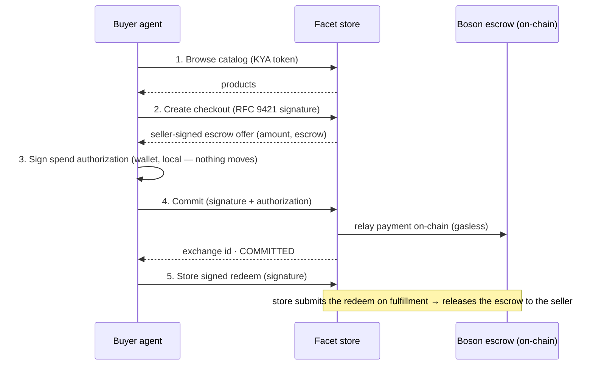

# How an agent can process a full purchase flow on a Facet store using x402B – Boson Escrow scheme

## What this is

This guide explains how a software **agent** — an autonomous buyer, or any app acting on a shopper's behalf — can complete a **full purchase** on a Facet-powered store: browse the catalog, choose a product, pay, and take delivery, with the money held safely in **escrow** until the order is fulfilled.

Payment settles through **Boson Protocol escrow** using the **x402B** scheme: the buyer authorizes a stablecoin (USDC) payment that is locked in an on-chain escrow contract. The seller is paid once the buyer's voucher is *redeemed* (on fulfillment) or the dispute window expires — until then the buyer is protected, and a dispute can be raised and settled by a registered dispute resolver. The store never takes custody of the funds, and the on-chain transactions are **gasless for the buyer** (the store's facilitator pays the gas).

The companion script **[`src/purchase.ts`](src/purchase.ts)** is a complete, self-contained working example of everything below. This document is the *why and what*; the code is the *how*.

## The big picture



## Requirements — three things the agent needs

| # | What | Used for | How to get it |
|---|------|----------|---------------|
| 1 | A funded **buyer wallet** (an EVM key) | Pays USDC into escrow; also signs the payment authorizations | Any Ethereum key. Fund its address with USDC on the store's network. **No ETH needed** (gasless). |
| 2 | Your **agent identity**: an ES256 key + a **published UCP profile** | Signs the checkout requests (create / commit / redeem) | You generate it and publish the public half — see below. |
| 3 | A **KYA token** (Know-Your-Agent) | Reading the store catalog | Issued by the store's KYA issuer. The sandbox mints test tokens from a helper endpoint. |

### About the agent identity

The checkout endpoints aren't protected by a store-issued password or API key. Instead, **you sign each request with your own key**, and the store verifies it. Concretely:

- You generate an **ES256 (P-256) key pair** — once.
- You publish the **public** key in a small JSON document, a **UCP profile** (`ucp-profile.json`), hosted at any **public HTTPS URL you control**. A GitHub Gist "raw" URL is enough — it does **not** go on the store's website, and you do **not** need a special `/.well-known` path.
- On every checkout request you send the header `UCP-Agent: profile="https://…/ucp-profile.json"` together with an [RFC 9421](https://www.rfc-editor.org/rfc/rfc9421) signature. The store fetches your profile, finds your public key by its id, and verifies the signature.

In short: **for checkout, the store issues you nothing — your identity is your own key, and the profile URL is simply where the store fetches your public key to check your signature.** (This is the UCP "platform" model; see [ucp.dev](https://ucp.dev).)

The profile is just this:

```json
{
  "ucp_version": "1.0",
  "name": "Agent buyer",
  "signing_keys": [
    { "kid": "agent-1a2b3c4d", "kty": "EC", "crv": "P-256", "x": "…", "y": "…", "use": "sig", "alg": "ES256" }
  ]
}
```

## The purchase flow

Each step lists **what happens**, **what it requires**, and **where it is in the script**.

### 1 · Browse the catalog and choose a product

- **What happens:** the agent lists the store's products and selects one. This example picks the cheapest.
- **Requires:** a **KYA token** (catalog reads are authenticated).
- **In `src/purchase.ts`:** `client.search(...)` via `FacetClient` (which attaches a freshly-minted KYA token), then a `reduce` to pick the lowest price.

### 2 · Create a checkout session

- **What happens:** the agent asks the store to reserve and **price** the item (goods + shipping + tax) for a shipping address. The store returns a **seller-signed escrow offer** — the network, the USDC amount, and the escrow contract address.
- **Requires:** your **RFC 9421 signature** (this is a checkout endpoint).
- **In `src/purchase.ts`:** `POST /ucp/v1/checkout-sessions` via the `post()` helper; the offer is read from `payment_handlers["llc.facet.boson_escrow"][0].config.offer`.

### 3 · Authorize the payment locally

- **What happens:** the agent's wallet signs a **spend authorization** (an ERC-3009 "transfer with authorization") for the exact amount. Nothing is broadcast — **no money moves yet**.
- **Requires:** the **buyer wallet key** (handled by the x402B client library).
- **In `src/purchase.ts`:** `x402b.handle402(requirements)` returns the signed authorization (the "X‑PAYMENT"). The same seller-signed payload is echoed back in the commit body, so it is passed through verbatim; `parseEscrowPaymentRequirements` gives a validated, typed view of it for the amount / escrow / network reads.

### 4 · Commit — fund the escrow

- **What happens:** the agent submits the signed authorization; the store's facilitator relays it **on-chain**, locking the USDC in the Boson escrow. The response returns the committed **exchange id** and state `COMMITTED`. Gasless for the buyer.
- **Requires:** your **RFC 9421 signature**, and enough **USDC** in the wallet.
- **In `src/purchase.ts`:** `POST /ucp/v1/checkout-sessions/{id}/complete` with the `boson_commit_authorization` credential — gated behind `SETTLE=1` and a spend cap (`MAX_USDC`).

### 5 · Redeem — release on fulfillment

- **What happens:** the agent signs a **redeem** for the exchange and hands it to the store. The store **stores** it and submits it on-chain once the order is fulfilled — that's what releases the escrowed funds to the seller. (Deferred redeem: the buyer stays protected until fulfillment.)
- **Requires:** your **RFC 9421 signature**, and the **exchange id** from step 4.
- **In `src/purchase.ts`:** `x402b.signAction({ actionId: "boson-redeem", … })`, then `POST /ucp/v1/checkout-sessions/redeem` with `{ exchange_id, signed_payload }`.

## What you must implement (checklist)

1. **Generate an ES256 key** and **publish a UCP profile** with its public half (once).
2. **Implement RFC 9421 request signing** for the three checkout calls — sign `@method`, `@authority`, `@path`, the `UCP-Agent` header, an idempotency key, and the body digest. (See `signedHeaders()` in the script — one short function, no library.)
3. **Obtain a KYA token** for catalog reads (store-specific).
4. **Sign the payments** — don't hand-roll these; use `@bosonprotocol/x402-client`. `handle402` produces the local ERC-3009 spend authorization, which the store relays on-chain as part of the `complete` request; `signAction` signs the Boson redeem meta-transaction.
5. **Fund a wallet** with USDC on the store's network.
6. **Call the three checkout endpoints** in order: create → complete → redeem.

The example script does exactly these six things — nothing more.

## Running the example

Prerequisites: Node 22+, then `pnpm install` at the repo root. Run the commands below from
`examples/facet-store` (or prefix them with
`pnpm --filter @bosonprotocol/x402-example-facet-store`).

**1 · One-time setup** — generate your key + profile. Put the wallet key in `.env` rather than on
the command line: `.env` is git-ignored, so the key stays out of your shell history and out of the
process list.

```bash
cp .env.example .env   # then set BUYER_PRIVATE_KEY in it
pnpm buy --init
```

This writes `.facet-agent-key.json` (**private — keep it secret**) and `ucp-profile.json` (public) in the package root. Then:
- Publish `ucp-profile.json` at a public HTTPS URL (e.g. create a GitHub Gist, open **Raw**, copy that URL).
- Fund the printed wallet address with USDC on the store's network (Base Sepolia **test** USDC for the sandbox — no ETH needed).
- Add `UCP_PROFILE_URL` to `.env` — the public URL you just published the profile at.

**2 · Dry run** — prices and signs everything, moves nothing:

```bash
pnpm buy
```

**3 · Buy for real:**

```bash
SETTLE=1 pnpm buy
```

`.env` lives in the package root (next to `package.json`); real environment variables override it.
Keep secrets — `BUYER_PRIVATE_KEY` above all — in `.env` or a secret manager, never inline in a
command.

| Variable | Meaning |
|----------|---------|
| `BUYER_PRIVATE_KEY` | Wallet key (hex). Funds and signs the payment. |
| `UCP_PROFILE_URL` | Public URL of your published `ucp-profile.json`. |
| `SETTLE` | `1` to commit for real; unset = dry run. |
| `MAX_USDC` | Spend cap (default `20`). |
| `TERMINAL` | Store terminal URL (default: the sandbox). |

## Going to production

- Point `TERMINAL` at the live store (e.g. `https://<store>.facet.llc`).
- Switch the chain + USDC address in the script to the store's production network (e.g. Base mainnet, `eip155:8453`), and fund the wallet with **real** USDC.
- Obtain a **real KYA token** from the store's issuer instead of the sandbox test helper.
- Keep the machine clock accurate — a skewed clock makes both the request signature and the payment authorization expire ("signature stale" / "validBefore expired").

## Good to know

- **The store never holds your money.** Funds sit in the Boson escrow contract; the seller is paid only when the redeem is submitted (on fulfillment). A dispute window protects the buyer.
- **Gasless:** the buyer needs USDC but no ETH; the facilitator pays gas.
- **Safety:** the example refuses to spend above `MAX_USDC`, checks the wallet balance before committing, and defaults to a dry run.
