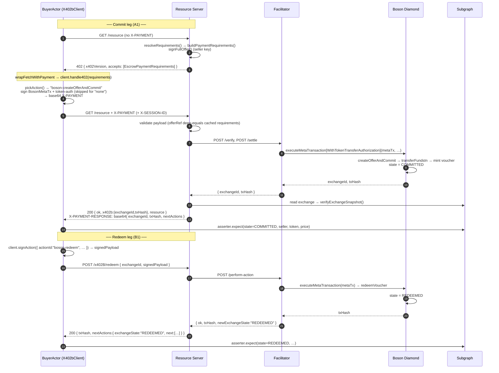

# Flow A — Deferred commit (commit now, redeem later)

> Walkthrough of the canonical x402B happy path as exercised by the e2e
> suite. Spec counterpart:
> [`docs/boson-impl-02-flows.md` § Flow A](../../../../../docs/boson-impl-02-flows.md).

## Overview & context

Flow A is the two-step purchase: the buyer first **commits** to a
freshly-signed offer (escrowing the price and minting an ERC-721
voucher → `COMMITTED`), then **redeems** the voucher in a separate
transaction (`REDEEMED`), and finally either completes or disputes. The
commit and redeem legs are independent on-chain transactions, so the
voucher is transferable in between and delivery data is attached at
redeem time, not commit time.

The first leg rides the standard x402 handshake: an unpaid `GET` returns
`402`, the client signs and retries with an `X-PAYMENT` header, and the
retry settles on-chain and returns `200` with an `X-PAYMENT-RESPONSE`.
What x402B adds is *what* gets signed (a Boson meta-transaction plus an
optional token-transfer authorization) and *where the money goes* (Boson
Diamond escrow, not the seller).

### Scenarios on this flow

| ID | What it pins | Test |
|---|---|---|
| **A1** | Deferred commit, `none` token-auth → `COMMITTED` | [`commit.test.ts:75`](../../test/scenarios/commit.test.ts#L75) |
| **A3** | Commit with ERC-3009 `ReceiveWithAuthorization` | [`commit.test.ts:191`](../../test/scenarios/commit.test.ts#L191) |
| **A4** | Commit with EIP-2612 `Permit` | [`commit.test.ts:260`](../../test/scenarios/commit.test.ts#L260) |
| **A5** | Commit with Permit2 `PermitTransferFrom` | [`commit.test.ts:328`](../../test/scenarios/commit.test.ts#L328) |
| **B1** | Redeem after deferred commit → `REDEEMED` | [`post-commit.test.ts:109`](../../test/scenarios/post-commit.test.ts#L109) |
| **B7** | Cancel voucher before redeem → `CANCELLED` (via facilitator) | [`post-commit.test.ts:311`](../../test/scenarios/post-commit.test.ts#L311) |

A2 (atomic commit-and-redeem) collapses both legs into one tx and is
documented under Flow B.

## Actors

| Actor | Played by | Defined in |
|---|---|---|
| **Buyer / client** | `BuyerActor` — wraps `X402bClient` (`createX402bClient`) and `wrapFetchWithPayment` | [`src/harness/buyer-actor.ts`](../../src/harness/buyer-actor.ts) |
| **Seller / resource server** | In-process Express app from `createResourceServerApp`; offers signed by `SellerActor` (`signFullOffer`) | [`examples/resource-server/src/app.ts`](../../../../../examples/resource-server/src/app.ts), [`src/harness/seller-actor.ts`](../../src/harness/seller-actor.ts) |
| **Facilitator** | The compose-service relayer at `:8889`; reached directly for `cancelVoucher` via `performCancelVoucher` | [`facilitator/src/perform-action/index.ts`](../../../facilitator/src/perform-action/index.ts), [`src/harness/facilitator-perform-action.ts`](../../src/harness/facilitator-perform-action.ts) |
| **Boson Diamond (escrow)** | The local-chain protocol Diamond at `LOCAL_31337_0.contracts.protocolDiamond` | — |
| **Subgraph** | Asserted through `OnchainAsserter` (retries on indexer lag) | [`src/harness/onchain-asserter.ts`](../../src/harness/onchain-asserter.ts) |

The whole `ScenarioContext` (server URL, actors, asserter, escrow
address, network) is assembled per test in
[`_setup.ts`](../../test/scenarios/_setup.ts).

## Sequence diagram

The commit leg (A1) and the redeem leg (B1):



## Step-by-step walkthrough

### Commit leg

**1–3 · The 402 challenge.** `ctx.buyer.fetch(".../resource")`
([`commit.test.ts:80`](../../test/scenarios/commit.test.ts#L80)) issues a
plain `GET`. The server's `/resource` route runs
`expressMiddleware(server, { resolveRequirements })`
([`app.ts:361`](../../../../../examples/resource-server/src/app.ts#L361));
with no `X-PAYMENT` header it answers `402` whose body is
`{ x402Version, accepts: [EscrowPaymentRequirements] }`.
`resolveRequirements` calls `server.buildPaymentRequirements(...)`
([`app.ts:261`](../../../../../examples/resource-server/src/app.ts#L261)),
which freshly signs a `FullOffer` with the seller's key — the result is
cached per `X-SESSION-ID` so the retry settles the *same* signed offer.
See the [402 payload](#402-paymentrequirements) below.

**4–6 · Sign & retry.** `wrapFetchWithPayment` (wired in
[`buyer-actor.ts:101`](../../src/harness/buyer-actor.ts#L101)) catches the
402 and calls `client.handle402(requirements)`
([`client.ts:104`](../../../client/src/client.ts#L104)). That:

- parses the requirements (`parseEscrowPaymentRequirements`),
- picks the action via `pickAction(...)`
  ([`action.ts:34`](../../../client/src/action.ts#L34)) — with the default
  `policy.redeemMode: "auto"` it prefers Flow A,
  `"boson-createOfferAndCommit"`,
- signs a Boson **meta-transaction** over that call (Diamond EIP-712
  domain) and, unless `tokenAuthStrategy: "none"`, a **token-transfer
  authorization** (the variant depends on the strategy — see
  [Token-auth variants](#token-auth-variants-a1--a3--a4--a5)),
- returns the base64 string set as the `X-PAYMENT` header on the retry.

The retry is `GET /resource` again, now carrying `X-PAYMENT` (decoded
shape in the [appendix](#x-payment-payload)).

**7–13 · Validate, settle, verify.** The middleware re-runs
`resolveRequirements` (hits the session cache), validates the payload
(deep-equals `payload.offerRef.fullOffer` against the cached
`requirements.offer.fullOffer` and strict-equals `sellerSig`), then calls
`server.handlers.commit`, which `POST`s `/verify` then `/settle` to the
facilitator. The facilitator submits
`executeMetaTransactionWithTokenTransferAuthorization` (or plain
`executeMetaTransaction` for `none`) to the Diamond; inside one tx the
Diamond runs `createOfferAndCommit`, pulls funds via `transferFundsIn`,
and mints the voucher → `COMMITTED`. The facilitator returns
`{ exchangeId, txHash }`; the server reads the exchange back through its
`ExchangeReader` and runs `verifyExchangeSnapshot` before responding.

**14 · Success response.** `200` with:

- body `{ ok: true, x402b: { exchangeId, txHash, … }, resource: "example resource bytes" }`
  (the `x402b` object is `res.locals.x402b`, set by the middleware), and
- an `X-PAYMENT-RESPONSE` header — base64 of
  `{ exchangeId, txHash, nextActions }`, stamped by
  `stampXPaymentResponseIfOk`
  ([`mount.ts:328`](../../../server-express/src/mount.ts#L328)).

**Assertions (A1, [`commit.test.ts:81–104`](../../test/scenarios/commit.test.ts#L81-L104)):**

- `res.status === 200`, `body.ok === true`, `body.x402b.exchangeId` is a string;
- `readXPaymentResponse(res.headers)` decodes non-null, its `exchangeId`
  equals the body's, and `txHash` matches `TX_HASH_REGEX`
  ([`x-payment-response-asserter.ts`](../../src/harness/x-payment-response-asserter.ts));
- `ctx.asserter.expect(exchangeId, { state: ExchangeState.COMMITTED, seller, exchangeToken: testErc20, price: EXPECTED_PRICE })`
  — polls the subgraph (≤20×, 500 ms) until `verifyExchangeSnapshot`
  matches.

### Redeem leg (B1)

**15–16 · Sign the redeem.** `performBuyerPostCommitAction({ actionId: "boson-redeem", … })`
([`post-commit.test.ts:111`](../../test/scenarios/post-commit.test.ts#L111))
calls `buyer.client.signAction({ actionId, exchangeId, network, escrowAddress })`
([`post-commit-http.ts:144`](../../src/harness/post-commit-http.ts#L144)),
which returns `{ metaTx, signedPayload }` — `signedPayload` is the
ABI-encoded `BosonMetaTx`.

**17 · POST to the server.** `POST ${resourceServerUrl}/x402B/redeem`
with body **`{ exchangeId, signedPayload }`** (no `X-PAYMENT-RESPONSE`
header is set on post-commit routes — see
[`mount.ts:138`](../../../server-express/src/mount.ts#L138)). Route table:
[`mount.ts:51`](../../../server-express/src/mount.ts#L51).

**18–22 · Relay & respond.** The server forwards to the facilitator's
perform-action path; the facilitator simulates then submits
`executeMetaTransaction` → `redeemVoucher` → `REDEEMED`, and the server
replies `{ txHash, nextActions: { exchangeId, exchangeState: "REDEEMED", next: [...] } }`.
The harness flattens that into `PostCommitActionResult`
(`{ txHash, newExchangeState, newDisputeState?, nextActionIds, fulfillment? }`)
in `flattenServerResponse`
([`post-commit-http.ts:183`](../../src/harness/post-commit-http.ts#L183)).

**Assertions (B1, [`post-commit.test.ts:119–127`](../../test/scenarios/post-commit.test.ts#L119-L127)):**
`result.txHash` matches `TX_HASH_REGEX`, `result.newExchangeState === ExchangeState.REDEEMED`,
and `asserter.expect(..., { state: REDEEMED, … })`.

### Cancel-before-redeem variant (B7)

`boson-cancelVoucher` is buyer-initiated but the example server mounts no
`/x402B/cancel` route, so B7
([`post-commit.test.ts:311`](../../test/scenarios/post-commit.test.ts#L311))
goes **straight to the facilitator** via `performCancelVoucher`
([`facilitator-perform-action.ts:72`](../../src/harness/facilitator-perform-action.ts#L72)):

- `buyer.client.signAction({ actionId: "boson-cancelVoucher", … })`, then
- `POST ${facilitatorUrl}/perform-action` with body
  **`{ action: "boson-cancelVoucher", exchangeId, network, escrowAddress, signedPayload }`**
  ([`facilitator-perform-action.ts:110`](../../src/harness/facilitator-perform-action.ts#L110)),
- response `{ ok: true, txHash, newExchangeState: "CANCELLED" }`.

Assertion: `cancelled.newExchangeState === ExchangeState.CANCELLED` and
`asserter.expect(..., { state: CANCELLED, … })`. This is the
censorship-resistance guarantee in action — the buyer ends their own
commitment without the seller's cooperation.

## Token-auth variants (A1 / A3 / A4 / A5)

All four reach the same `COMMITTED` end state; they differ only in how the
buyer authorizes the token pull. Once settled, the strategy is invisible
on-chain, so the assertions are identical except for `exchangeToken`.

| Scenario | `tokenAuthStrategies` advertised | Buyer pre-req | What's signed | Token |
|---|---|---|---|---|
| **A1** | `["none"]` | Standing ERC-20 allowance to the Diamond (`ensureBuyerCanPay`) | meta-tx only; `transferFundsIn` pulls via allowance | `testErc20` |
| **A3** | `["erc3009"]` | Balance only (`ensureBuyerHasBalance`) | meta-tx + ERC-3009 `ReceiveWithAuthorization` (inline transfer) | `testErc3009` |
| **A4** | `["permit"]` | Balance only | meta-tx + EIP-2612 `Permit` (settle calls `permit()` then `transferFrom`) | `testErc2612` |
| **A5** | `["permit2"]` | Allowance to the **canonical Permit2** contract | meta-tx + Permit2 `PermitTransferFrom` (canonical Permit2 domain) | `testErc20` |

Notes carried straight from the tests:

- The `none` pin matters: without it the client dispatcher defaults to
  `permit2` and the `transferFrom` would revert with `ERC20: insufficient
  allowance`, because the buyer only approved the Diamond, not Permit2.
  See `NONE_TOKEN_AUTH_SCENARIO`
  ([`_setup.ts:171`](../../test/scenarios/_setup.ts#L171)).
- A3/A4/A5 set `maxTimeoutSeconds: 24 * 60 * 60`. The local stack mines at
  ~20× wall-clock, so the default 1-hour `validBefore` / `deadline` can
  already be in the past by the time `settle` simulates against
  `block.timestamp`.
- ERC-3009 and Permit require a `tokenDomainResolver`
  (`createChainTokenDomainResolver(publicClient)`) so the client can sign
  against the token's own EIP-712 domain; Permit2 uses the canonical
  Permit2 domain and needs no resolver.

## Payload appendix

### 402 `PaymentRequirements`

Emitted inside `accepts[0]`; type
[`EscrowPaymentRequirements`](../../../core/src/schemes/escrow/payment-requirements.ts).

```jsonc
{
  "scheme": "escrow",
  "network": "eip155:31337",
  "asset": "0x…",                     // testErc20 (or testErc3009/testErc2612)
  "amount": "1000000",                // atomic units, decimal string (1 USDC @ 6dp)
  "escrowAddress": "0x…",             // Boson Diamond — the custodian
  "recipientId": "12",                // routing-only seller id
  "maxTimeoutSeconds": 3600,          // 86400 for A3/A4/A5
  "offer": {
    "fullOffer": { /* signed Boson FullOffer template */ },
    "sellerSig": "0x…",
    "creator": "0x…"                  // seller address
  },
  "tokenAuthStrategies": ["none"],    // narrowed per scenario
  "fulfillment": { "required": false, "options": [] },
  "actions": {
    "next": [
      { "id": "boson-createOfferAndCommit",       "channels": ["server", "facilitator", "onchain"] },
      { "id": "boson-createOfferCommitAndRedeem", "channels": ["server", "facilitator", "onchain"] }
    ],
    "fallback": { /* onchainHints, … */ }
  }
}
```

### `X-PAYMENT` payload

Base64 of [`EscrowPaymentPayload`](../../../core/src/schemes/escrow/payment-payload.ts);
decoded shape for the `none` strategy (no `tokenAuth`):

```jsonc
{
  "x402Version": 1,
  "scheme": "escrow",
  "network": "eip155:31337",
  "payload": {
    "action": "boson-createOfferAndCommit",
    "tokenAuthStrategy": "none",
    "offerRef": { "fullOffer": { /* … */ }, "sellerSig": "0x…" },
    "buyer": "0x…",
    "metaTx": {
      "from": "0x…",
      "nonce": "…",
      "functionName": "createOfferAndCommit",
      "functionSignature": "0x…",      // ABI-encoded inner call
      "sig": { "v": 27, "r": "0x…", "s": "0x…" }
    }
    // "tokenAuth": { "kind": "erc3009" | "permit" | "permit2", "data": { … } }  // present iff strategy ≠ "none"
  }
  // "fulfillment": { "option": "…", "data": … }  // Flow A omits data — it travels at redeem time
}
```

### `X-PAYMENT-RESPONSE` (commit 200)

Base64 of the commit handler body; the harness decodes it with
`readXPaymentResponse`:

```jsonc
{ "exchangeId": "13", "txHash": "0x…", "nextActions": { "exchangeState": "COMMITTED", "next": [ /* … */ ] } }
```

### Redeem request / response (B1)

```jsonc
// POST /x402B/redeem
{ "exchangeId": "13", "signedPayload": "0x…" }

// 200
{ "txHash": "0x…", "nextActions": { "exchangeId": "13", "exchangeState": "REDEEMED", "next": [ /* completeExchange, raiseDispute, … */ ] } }
```

## Code map

| Step | Harness | SDK / server / facilitator | Boson Diamond |
|---|---|---|---|
| GET → 402 | `buyer.fetch` | `expressMiddleware` → `buildPaymentRequirements` → `signFullOffer` | — |
| Sign X-PAYMENT | `wrapFetchWithPayment` | `client.handle402` → `pickAction` → meta-tx + token-auth signing | — |
| Settle commit | — | `server.handlers.commit` → facilitator `/verify` + `/settle` | `executeMetaTransaction[WithTokenTransferAuthorization]` → `createOfferAndCommit` → `transferFundsIn` |
| Verify state | `asserter.expect` | `verifyExchangeSnapshot` (via `ExchangeReader`) | — |
| Redeem | `performBuyerPostCommitAction` | `client.signAction` → `POST /x402B/redeem` → `performAction` | `executeMetaTransaction` → `redeemVoucher` |
| Cancel (B7) | `performCancelVoucher` | `client.signAction` → facilitator `POST /perform-action` | `executeMetaTransaction` → `cancelVoucher` |

Action IDs and their on-chain primitives:
[`docs/boson-impl-04-state-machine-and-next-actions.md` § Action IDs](../../../../../docs/boson-impl-04-state-machine-and-next-actions.md).

## Failure modes

Commit-time guards live in
[`validation-commit.test.ts`](../../test/scenarios/validation-commit.test.ts);
each tampers with one part of the commit payload and asserts a structured
error rather than an accidental settle:

| ID | Tampered input | Expected |
|---|---|---|
| **C1** | `functionSignature` calldata altered after signing | `CALLDATA_MISMATCH` |
| **C2** | meta-tx signature doesn't recover to `metaTx.from` | `BAD_META_TX_SIGNATURE` |
| **C3** | replayed meta-tx nonce | nonce-replay rejection |
| **C4** | expired ERC-3009 `validBefore` | rejected |
| **C5** | token-auth deadline exceeded | `TOKEN_AUTH_DEADLINE_EXCEEDED` |
| **C8** | non-allowlisted escrow address | rejected (facilitator escrow allowlist, [`perform-action/index.ts:172`](../../../facilitator/src/perform-action/index.ts#L172)) |

Post-commit illegal transitions (e.g. C10 redeem-after-cancel) live in
[`validation-post-commit.test.ts`](../../test/scenarios/validation-post-commit.test.ts).
