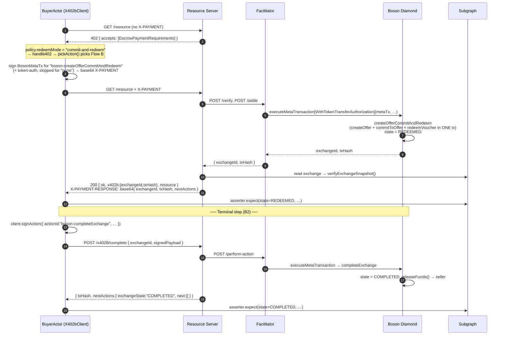

# Flow B — Atomic commit-and-redeem (single transaction)

> Walkthrough of the one-transaction purchase as exercised by the e2e
> suite. Spec counterpart:
> [`docs/boson-impl-02-flows.md` § Flow B](../../../../../docs/boson-impl-02-flows.md).

## Overview & context

Flow B collapses the **commit** and **redeem** state transitions into a
single on-chain transaction: the exchange lands directly in `REDEEMED`
rather than passing through `COMMITTED` first. Everything else about the
HTTP handshake is identical to [Flow A](./flow-a-deferred-commit.md) — the
only difference is which Boson action the client signs.

The choice is purely about *when the on-chain redeem happens*; it is
independent of when the resource is delivered. Because there is no later
redeem round-trip, any buyer-supplied delivery data must travel **with the
`X-PAYMENT`** at commit time (see
[Fulfillment timing](#fulfillment-timing-vs-flow-a)).

From `REDEEMED`, the exchange's terminal happy-path step is
`completeExchange`, which releases the escrowed funds to the seller —
the same step whether the exchange reached `REDEEMED` atomically (Flow B)
or via a separate redeem (Flow A).

### Scenarios on this flow

| ID | What it pins | Test |
|---|---|---|
| **A2** | Atomic commit-and-redeem, `none` token-auth → `REDEEMED` | [`commit.test.ts:111`](../../test/scenarios/commit.test.ts#L111) |
| **B2** | `completeExchange` after redeem → `COMPLETED`, escrow released | [`post-commit.test.ts:130`](../../test/scenarios/post-commit.test.ts#L130) |

> B2's test reaches `REDEEMED` via Flow A legs (commit → redeem) and then
> completes; the completion mechanics are identical for a Flow B exchange,
> so it's documented here as the terminal step of the atomic flow.

## Actors

Same cast as [Flow A](./flow-a-deferred-commit.md#actors): `BuyerActor`
(wrapping `X402bClient`), the in-process resource server, the facilitator,
the Boson Diamond, and the subgraph (via `OnchainAsserter`). The only
behavioural change is the buyer's `Policy`.

## Sequence diagram



## Step-by-step walkthrough

### A2 — the atomic commit

The only setup difference from A1 is the buyer's policy
([`commit.test.ts:116`](../../test/scenarios/commit.test.ts#L116)):

```ts
const atomicBuyer = createBuyerActor({
  account: buyerAccount,
  publicClient: ctx.buyer.publicClient,
  policy: { ...NONE_TOKEN_AUTH_SCENARIO.buyerPolicy, redeemMode: "commit-and-redeem" },
});
```

When `wrapFetchWithPayment` calls `client.handle402(requirements)`,
`pickAction(...)` ([`action.ts:47`](../../../client/src/action.ts#L47))
sees `redeemMode === "commit-and-redeem"` and selects
`"boson-createOfferCommitAndRedeem"` (Flow B), throwing
`NoCompatibleActionError` if the server hadn't advertised it. The
`X-PAYMENT` is otherwise built exactly as in Flow A — the
`payload.action` field is the only change on the wire.

The facilitator settles via the Diamond's
`OrchestrationHandlerFacet2.createOfferCommitAndRedeem`, which performs
create-offer + commit + redeem in a single transaction (emitting
`OfferCreated`, `BuyerCommitted`, and `VoucherRedeemed`). The committer —
and therefore the redeemer — is `_msgSender()`, which under the meta-tx
entrypoint is the buyer recovered from the meta-tx signature, so no
separate redeem signature is required.

**Assertions ([`commit.test.ts:122–144`](../../test/scenarios/commit.test.ts#L122-L144)):**
`res.status === 200`, `body.ok`, `body.x402b.exchangeId` a string; the
decoded `X-PAYMENT-RESPONSE` `exchangeId` matches and `txHash` matches
`TX_HASH_REGEX`; and crucially
`asserter.expect(exchangeId, { state: ExchangeState.REDEEMED, … })` —
**`REDEEMED`, not `COMMITTED`** — is the one assertion that distinguishes
Flow B from Flow A.

### B2 — complete the exchange

`performBuyerPostCommitAction({ actionId: "boson-completeExchange", … })`
([`post-commit.test.ts:140`](../../test/scenarios/post-commit.test.ts#L140))
signs the meta-tx and `POST`s `/x402B/complete`
([route table `mount.ts:52`](../../../server-express/src/mount.ts#L52))
with `{ exchangeId, signedPayload }`. The facilitator submits
`completeExchange`; the Diamond moves the exchange to `COMPLETED` and
releases the escrowed funds to the seller's available-funds balance.

**Assertions ([`post-commit.test.ts:148–155`](../../test/scenarios/post-commit.test.ts#L148-L155)):**
`completed.newExchangeState === ExchangeState.COMPLETED` and
`asserter.expect(..., { state: COMPLETED, … })`.

## Fulfillment timing vs Flow A

The wire schema treats `fulfillment.data` as action-conditional
([`payment-payload.ts:106`](../../../core/src/schemes/escrow/payment-payload.ts#L106)):

- **Flow B (`boson-createOfferCommitAndRedeem`):** `data` MUST be present
  (or `null` when the chosen option's schema is `null`). The redeem
  completes inside the commit transaction, so there's no later round-trip
  in which the buyer could hand over delivery data — it must ride the
  `X-PAYMENT`.
- **Flow A (`boson-createOfferAndCommit`):** `data` MUST be omitted at
  commit; the buyer attaches it to the redeem-time POST body.

A2 advertises no fulfillment channels, so its `X-PAYMENT` omits the block
entirely; the rule above is what an inline/atomic-delivery scenario (A6
under Flow A's fulfillment work) exercises.

## Payload appendix

### `X-PAYMENT` payload (Flow B)

Identical to the [Flow A payload](./flow-a-deferred-commit.md#x-payment-payload)
except for `payload.action`:

```jsonc
{
  "x402Version": 1,
  "scheme": "escrow",
  "network": "eip155:31337",
  "payload": {
    "action": "boson-createOfferCommitAndRedeem",
    "tokenAuthStrategy": "none",
    "offerRef": { "fullOffer": { /* … */ }, "sellerSig": "0x…" },
    "buyer": "0x…",
    "metaTx": { "from": "0x…", "nonce": "…", "functionName": "createOfferCommitAndRedeem", "functionSignature": "0x…", "sig": { "v": 27, "r": "0x…", "s": "0x…" } }
  }
  // "fulfillment": { "option": "inline", "data": { … } }  // REQUIRED for atomic delivery
}
```

### Complete request / response (B2)

```jsonc
// POST /x402B/complete
{ "exchangeId": "13", "signedPayload": "0x…" }

// 200
{ "txHash": "0x…", "nextActions": { "exchangeId": "13", "exchangeState": "COMPLETED", "next": [] } }
```

`next` is the empty array on the terminal `COMPLETED` state — the harness
rejects a response that omits `next` or stamps a non-array
([`post-commit-http.ts:206`](../../src/harness/post-commit-http.ts#L206)).

## Code map

| Step | Harness | SDK / server / facilitator | Boson Diamond |
|---|---|---|---|
| GET → 402 | `buyer.fetch` | `expressMiddleware` → `buildPaymentRequirements` → `signFullOffer` | — |
| Sign X-PAYMENT (Flow B) | `wrapFetchWithPayment` | `client.handle402` → `pickAction` (redeemMode `commit-and-redeem`) | — |
| Settle atomically | — | `server.handlers.commitAndRedeem` → facilitator `/verify` + `/settle` | `OrchestrationHandlerFacet2.createOfferCommitAndRedeem` |
| Verify REDEEMED | `asserter.expect` | `verifyExchangeSnapshot` | — |
| Complete (B2) | `performBuyerPostCommitAction("boson-completeExchange")` | `client.signAction` → `POST /x402B/complete` → `performAction` | `completeExchange` → `releaseFunds` |

Action IDs and their on-chain primitives:
[`docs/boson-impl-04-state-machine-and-next-actions.md` § Action IDs](../../../../../docs/boson-impl-04-state-machine-and-next-actions.md).

## Failure modes

- **`commit-and-redeem` not advertised:** if the server's `accepts[].actions.next`
  doesn't list `boson-createOfferCommitAndRedeem` on the `server` channel,
  `pickAction` throws `NoCompatibleActionError` client-side
  ([`action.ts:48`](../../../client/src/action.ts#L48)) — the buyer never
  sends a doomed `X-PAYMENT`.
- The commit-time validation negatives (C1–C5, C8 — see
  [Flow A § Failure modes](./flow-a-deferred-commit.md#failure-modes))
  apply identically to the Flow B `X-PAYMENT`, since both flows share the
  settle path.
