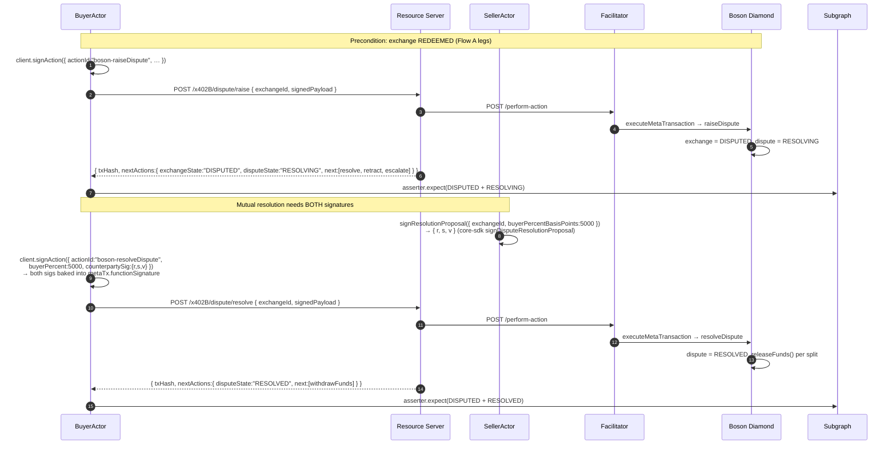

# Flow C — Dispute path

> Walkthrough of the post-redeem dispute lifecycle as exercised by the
> e2e suite. Spec counterpart:
> [`docs/boson-impl-02-flows.md` § Flow C](../../../../../docs/boson-impl-02-flows.md)
> and the dispute state machine in
> [`docs/boson-impl-04-state-machine-and-next-actions.md`](../../../../../docs/boson-impl-04-state-machine-and-next-actions.md).

## Overview & context

Once an exchange is `REDEEMED`, the buyer has a dispute window. Raising a
dispute moves the **exchange** to `DISPUTED` and starts a separate
**dispute** state machine in `RESOLVING`. From `RESOLVING` the buyer can:

- **resolve** — a mutual settlement that needs *both* the buyer's and the
  seller's signature over the same split (`RESOLVED`),
- **retract** — drop the dispute, releasing funds to the seller
  (`RETRACTED`), or
- **escalate** — hand it to the registered dispute resolver
  (`ESCALATED` → `DECIDED`/`REFUSED`; not yet implemented in the suite).

The defining property the tests pin is the **dual-signature** requirement
on `resolveDispute`: the buyer assembles the seller's signature as a
`counterpartySig` before submitting, and a signature from anyone other
than the seller reverts on-chain.

### Scenarios on this flow

| ID | What it pins | Test |
|---|---|---|
| **B3** | `raiseDispute` after redeem → `DISPUTED` + `RESOLVING` | [`post-commit.test.ts:158`](../../test/scenarios/post-commit.test.ts#L158) |
| **B4** | Mutual `resolveDispute` 50/50 (dual-sig) → `RESOLVED` | [`post-commit.test.ts:188`](../../test/scenarios/post-commit.test.ts#L188) |
| **B6** | `retractDispute` by buyer → `RETRACTED` (seller wins) | [`post-commit.test.ts:273`](../../test/scenarios/post-commit.test.ts#L273) |
| **E3** | `resolveDispute` rejects a non-seller counterparty sig, accepts the seller's | [`multi-party.test.ts:163`](../../test/scenarios/multi-party.test.ts#L163) |

Each starts from a fresh `commitFreshExchange(...)` → `boson-redeem`
sequence (the Flow A legs) to reach `REDEEMED` before raising the dispute.

## Actors

| Actor | Played by | Defined in |
|---|---|---|
| **Buyer / client** | `BuyerActor` — drives every transition via `client.signAction` | [`src/harness/buyer-actor.ts`](../../src/harness/buyer-actor.ts) |
| **Seller** | `SellerActor.signResolutionProposal` — signs the `Resolution` proposal the buyer needs as `counterpartySig` | [`src/harness/seller-actor.ts`](../../src/harness/seller-actor.ts#L122) |
| **Resource server** | In-process app; mounts `POST /x402B/dispute/{raise,resolve,retract,escalate}` | [`server-express/src/mount.ts:53`](../../../server-express/src/mount.ts#L53) |
| **Facilitator** | Relays each signed meta-tx; on-chain revert surfaces as HTTP 502 | [`facilitator/src/perform-action/index.ts`](../../../facilitator/src/perform-action/index.ts) |
| **Dispute resolver** | `ResolverActor` — present in the cast for the escalation branch (B5/B9), **not yet exercised** | [`src/harness/resolver-actor.ts`](../../src/harness/resolver-actor.ts) |
| **Boson Diamond / Subgraph** | `DisputeHandlerFacet` transitions; asserted via `OnchainAsserter` with a `disputeState` field | [`src/harness/onchain-asserter.ts`](../../src/harness/onchain-asserter.ts) |

## Sequence diagram

The mutual-resolution path (B4 / E3), which subsumes the raise (B3) step:



## Step-by-step walkthrough

### B3 — raise the dispute

After `boson-redeem`,
`performBuyerPostCommitAction({ actionId: "boson-raiseDispute", … })`
([`post-commit.test.ts:168`](../../test/scenarios/post-commit.test.ts#L168))
signs the meta-tx (`client.signAction`) and `POST`s
`/x402B/dispute/raise` with `{ exchangeId, signedPayload }`. The
facilitator submits `raiseDispute`; the Diamond moves the exchange to
`DISPUTED` and opens the dispute in `RESOLVING`.

The flattened response carries both states
([`post-commit-http.ts:218`](../../src/harness/post-commit-http.ts#L218)):

**Assertions ([`post-commit.test.ts:176–185`](../../test/scenarios/post-commit.test.ts#L176-L185)):**
`disputed.newExchangeState === ExchangeState.DISPUTED`,
`disputed.newDisputeState === DisputeState.RESOLVING`, and
`asserter.expect(..., { state: DISPUTED, disputeState: RESOLVING, … })`.
The asserter forwards `disputeState` into `verifyExchangeSnapshot`
([`onchain-asserter.ts:59`](../../src/harness/onchain-asserter.ts#L59)).

### B4 — mutual resolution (50/50)

The buyer can't resolve alone. The seller first signs the split:

```ts
const sellerSig = await ctx.seller.signResolutionProposal({
  exchangeId,
  buyerPercentBasisPoints: 5000n, // 10000 = 100%
});
```

`signResolutionProposal`
([`seller-actor.ts:122`](../../src/harness/seller-actor.ts#L122)) routes
through core-sdk's `signDisputeResolutionProposal` (so the EIP-712
`Resolution(uint256 exchangeId, uint256 buyerPercentBasisPoints)`
type-list stays in lock-step with the deployed protocol) and returns
`{ r, s, v, signature }`.

The buyer then aggregates it:

```ts
performBuyerPostCommitAction({
  actionId: "boson-resolveDispute",
  exchangeId, escrowAddress: ctx.escrowAddress, network: ctx.network,
  buyer: ctx.buyer, resourceServerUrl: ctx.resourceServerUrl,
  buyerPercent: 5000n,
  counterpartySig: { r: sellerSig.r, s: sellerSig.s, v: sellerSig.v },
});
```

`buyerPercent` and `counterpartySig` are passed to
`client.signAction({ actionId: "boson-resolveDispute", … })`
([`post-commit-http.ts:136`](../../src/harness/post-commit-http.ts#L136))
and **baked into the meta-tx's `functionSignature`** — they are *not*
separate wire fields. The POST body is still just
**`{ exchangeId, signedPayload }`**
([`post-commit-http.ts:153`](../../src/harness/post-commit-http.ts#L153)).
The facilitator submits `resolveDispute`; the Diamond verifies both
recovered signers (buyer = `metaTx.from`, seller = the proposal signer),
moves the dispute to `RESOLVED`, and releases each party's share to their
available funds balance.

**Assertions ([`post-commit.test.ts:232–240`](../../test/scenarios/post-commit.test.ts#L232-L240)):**
`resolved.newDisputeState === DisputeState.RESOLVED` and
`asserter.expect(..., { state: DISPUTED, disputeState: RESOLVED, … })`.
(The exchange stays `DISPUTED`; the dispute entity transitions
independently.) The post-`RESOLVED` `next[]` carries the lone
`boson-withdrawFunds` entry — see
[boson-impl-04 § nextActions integration](../../../../../docs/boson-impl-04-state-machine-and-next-actions.md).

### B6 — retract

`performBuyerPostCommitAction({ actionId: "boson-retractDispute", … })`
([`post-commit.test.ts:292`](../../test/scenarios/post-commit.test.ts#L292))
`POST`s `/x402B/dispute/retract` with `{ exchangeId, signedPayload }`. No
counterparty signature is needed — the buyer is dropping their own
dispute, so the funds release to the seller. Result: dispute `RETRACTED`.

**Assertions ([`post-commit.test.ts:300–308`](../../test/scenarios/post-commit.test.ts#L300-L308)):**
`retracted.newDisputeState === DisputeState.RETRACTED` and
`asserter.expect(..., { state: DISPUTED, disputeState: RETRACTED, … })`.

### E3 — the dual-signature regression

E3 ([`multi-party.test.ts:163`](../../test/scenarios/multi-party.test.ts#L163))
isolates "both signatures are required" by changing **only the signer**
between a failing and a succeeding attempt against the same
`buyerPercentBasisPoints`:

1. **Negative.** The buyer submits `resolveDispute` with a proposal signed
   by a throwaway key (a `SellerActor` wrapping a random account, not the
   real seller). The Diamond recovers the counterparty signer, finds it
   isn't the seller, and reverts. The facilitator's `ONCHAIN_REVERT`
   surfaces as HTTP **502**, which the harness throws as
   `PostCommitActionError` (`rejected.status === 502`). The asserter then
   confirms the dispute is untouched — still `DISPUTED` + `RESOLVING`.
2. **Positive.** The real seller signs the identical split; the resolve
   now succeeds → `RESOLVED`.

This is the clearest worked example of why `resolveDispute` needs the
counterparty's cooperation, in contrast to `retract`/`raise` which the
buyer drives alone.

## Payload appendix

### Dispute action request (raise / resolve / retract)

Every buyer-driven dispute transition POSTs the same minimal body; the
action and (for resolve) the split + counterparty signature are encoded
*inside* `signedPayload`:

```jsonc
// POST /x402B/dispute/{raise|resolve|retract}
{ "exchangeId": "13", "signedPayload": "0x…" }
```

### Dispute action response

```jsonc
// raiseDispute → 200
{ "txHash": "0x…", "nextActions": { "exchangeId": "13", "exchangeState": "DISPUTED", "disputeState": "RESOLVING",
  "next": [ { "id": "boson-resolveDispute", … }, { "id": "boson-escalateDispute", … }, { "id": "boson-retractDispute", … } ] } }

// resolveDispute → 200
{ "txHash": "0x…", "nextActions": { "exchangeState": "DISPUTED", "disputeState": "RESOLVED",
  "next": [ { "id": "boson-withdrawFunds", … } ] } }
```

### Seller resolution proposal

`SellerActor.signResolutionProposal` returns:

```jsonc
{ "r": "0x…", "s": "0x…", "v": 27, "signature": "0x…" }  // 65-byte concatenated sig also provided
```

The buyer passes `{ r, s, v }` as `counterpartySig`; `signature` is the
equivalent concatenated form (`client.signAction` accepts either).

## Code map

| Step | Harness | SDK / server / facilitator | Boson Diamond |
|---|---|---|---|
| Reach `REDEEMED` | `performBuyerPostCommitAction("boson-redeem")` | see Flow A | `redeemVoucher` |
| Raise dispute | `performBuyerPostCommitAction("boson-raiseDispute")` | `client.signAction` → `POST /x402B/dispute/raise` → `performAction` | `DisputeHandlerFacet.raiseDispute` |
| Sign seller proposal | `seller.signResolutionProposal` | core-sdk `signDisputeResolutionProposal` (EIP-712 `Resolution`) | — |
| Mutual resolve | `performBuyerPostCommitAction("boson-resolveDispute", buyerPercent, counterpartySig)` | `client.signAction` (aggregates both sigs) → `POST /x402B/dispute/resolve` | `DisputeHandlerFacet.resolveDispute` |
| Retract | `performBuyerPostCommitAction("boson-retractDispute")` | `client.signAction` → `POST /x402B/dispute/retract` | `DisputeHandlerFacet.retractDispute` |
| Verify state | `asserter.expect({ disputeState })` | `verifyExchangeSnapshot` | — |

## Failure modes

| ID | Condition | Expected | Where |
|---|---|---|---|
| **E3 (negative)** | `resolveDispute` with a non-seller counterparty sig | on-chain revert → HTTP 502 → `PostCommitActionError`; dispute unchanged | [`multi-party.test.ts:199`](../../test/scenarios/multi-party.test.ts#L199) |
| **C9** | seller signature mismatch on resolution | rejected | [`validation-post-commit.test.ts`](../../test/scenarios/validation-post-commit.test.ts) |
| **C10** | redeem after cancel (illegal transition) | rejected | [`validation-post-commit.test.ts`](../../test/scenarios/validation-post-commit.test.ts) |

The escalation branch (`escalateDispute` → resolver `decideDispute`,
scenarios B5/B9) is specced in the dispute state machine but parked in
[`_skeletons.test.ts`](../../test/scenarios/_skeletons.test.ts) pending
dispute-resolver-deposit handling and `ResolverActor` wallet signing.
